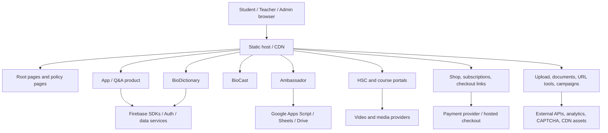
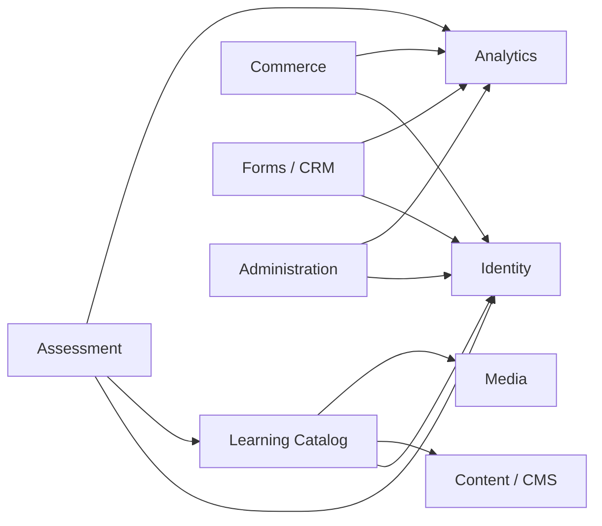
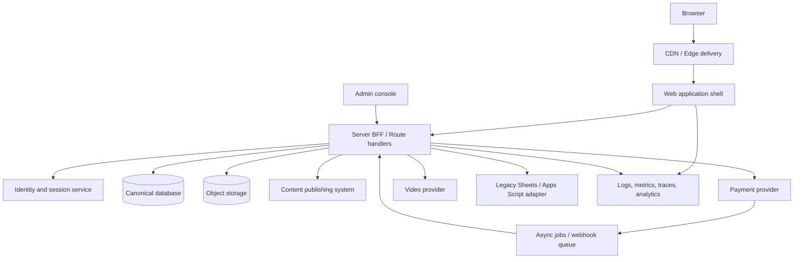

# Apar's Classroom — System Architecture

**Status:** Proposed architecture based on repository inspection
**Audience:** Senior engineers, maintainers, product owners, security reviewers, and future contributors
**Scope:** The complete Apar's Classroom static multi-product education platform
**Last reviewed:** 2026-09-06

> This document separates **current-state observations** from **target-state recommendations**. It is an architecture design and migration guide, not a claim that every proposed service already exists in production.

---

## 1. Executive Summary

Apar's Classroom is currently a large static web platform composed of multiple independently evolved products: the main learning/Q&A application, BioDictionary, BioCast, Ambassador, HSC and course portals, shop and payment surfaces, upload/admin utilities, documents, quizzes, and campaign pages. Most pages are directory-routed HTML documents with local CSS and JavaScript; behavior is completed in the browser through Firebase, Google endpoints, video providers, payment links, and other third-party services.

The recommended architecture is an **incremental modular platform**, not a big-bang rewrite:

1. Preserve all public URLs and existing content during migration.
2. Define domain ownership before moving implementation.
3. Introduce shared UI, configuration, validation, and observability primitives.
4. Put privileged operations behind a server-side BFF/API boundary.
5. Make Firebase the explicit identity/data boundary only where it is the authoritative system.
6. Move exams, entitlements, payments, uploads, and admin workflows away from client authority.
7. Migrate product areas one at a time with route-level rollback.

### Architectural principles

- **URL compatibility first:** existing links, campaigns, search results, and certificates must continue to resolve.
- **Server authority for trust:** browsers may request actions; they must not decide authorization, price, score, entitlement, or ownership.
- **One owner per fact:** each business fact has one canonical writer and clearly defined read projections.
- **Product boundaries over folder boundaries:** directories are historical; domains and capabilities are the durable boundaries.
- **Progressive modernization:** improve the highest-risk flows first without blocking content publishing.
- **Observable failure:** every external dependency has timeout, error, retry, and degraded-mode behavior.
- **Accessible by default:** semantic HTML, keyboard support, readable contrast, responsive layouts, and useful error states are release criteria.

---

## 2. Current-State Architecture

### 2.1 Runtime model

The repository behaves primarily as a static website:

- HTML files act as page entry points.
- Directory names form public URL boundaries.
- CSS and JavaScript are frequently colocated with each product.
- Browser JavaScript performs rendering, validation, API calls, authentication, and navigation.
- Static hosting is compatible with GitHub Pages-style deployment.
- Third-party SDKs and CDN scripts are loaded directly by pages.
- Firebase and Google services provide parts of identity, content, forms, or persistence.

There is no single application shell, package boundary, backend-for-frontend, or globally enforced design system in the current layout. Similar functionality is implemented in several product-local variants.

### 2.2 Current logical topology



### 2.3 Current strengths

- Fast initial delivery for content-heavy pages.
- Low hosting complexity and low infrastructure cost.
- Direct ownership of educational content and static assets.
- Public URLs are simple to share and index.
- Product teams can ship independently when they understand their local conventions.
- External hosted checkout and media reduce the amount of sensitive infrastructure maintained in the repository.

### 2.4 Current weaknesses and risks

- Client-side authorization and business rules can be bypassed if the backend does not independently enforce them.
- Duplicated scripts and styles produce inconsistent behavior and increase regression risk.
- Direct third-party calls from the browser expose integration shape, create CORS/dependency failures, and make rate limiting difficult.
- Browser storage, URL parameters, and hidden form fields must be treated as untrusted input.
- Exam timing, answer selection, score calculation, and high-score display are vulnerable if authoritative state remains in the client.
- Static HTML makes global metadata, navigation, accessibility, and security headers difficult to enforce consistently.
- CDN scripts and inline snippets create supply-chain and Content Security Policy challenges.
- There is no single documented source of truth for roles, entitlements, content lifecycle, or operational ownership.

---

## 3. Product and Domain Boundary Map

The following boundaries are recommended as business domains. A domain owns its rules, data contracts, and operational alerts even if the first implementation remains static.

| Domain | Responsibilities | Canonical data | Primary users | Dependencies |
|---|---|---|---|---|
| Public Platform | Home, policies, SEO, navigation, announcements | Pages, navigation, legal versions | Everyone | Content, analytics |
| Identity | Sign-in, sign-up, sessions, account recovery, role claims | Users, identities, sessions, roles | Students, teachers, admins | Firebase Auth or future identity provider |
| Learning Catalog | Courses, lessons, chapters, schedules, instructors | Published content, course metadata | Students, teachers | CMS/content storage, video |
| Q&A / Community | Questions, answers, moderation, reactions, reports | Posts, answers, moderation events | Students, moderators | Identity, notifications |
| BioDictionary | Biology terms, definitions, categories, practice content | Dictionary entries and revisions | Students | Identity, search, assessment |
| Assessment | Question banks, exams, attempts, scoring, results | Versioned questions, attempts, grade records | Students, teachers | Identity, learning catalog |
| Media | Video, audio, thumbnails, downloadable assets | Media metadata and access policy | Everyone | CDN/video provider/storage |
| Commerce | Plans, products, prices, orders, subscriptions, entitlements | Orders, payment events, entitlements | Students, finance/admin | Payment provider, identity |
| Forms and CRM | Applications, ambassador forms, leads, support requests | Form submissions and status | Applicants, admins | Apps Script/Sheets or database |
| Uploads | User/admin uploads, documents, guides, assets | File metadata and access grants | Students, admins | Blob/object storage, scanning |
| Administration | Moderation, content publishing, user support, audit | Admin actions, audit events | Staff | All domains, identity |
| Analytics | Product events, funnels, errors, performance | Events and derived reports | Product/team | Analytics provider |

### Dependency direction



**Rule:** lower-level platform capabilities must not import product-page internals. A course page may consume catalog and media contracts; the catalog service must not depend on a specific page's DOM or CSS.

---

## 4. Target Logical Architecture



### Recommended layers

1. **Presentation layer:** route-compatible pages, shared layout, accessible components, loading/error states.
2. **Application layer:** use-case functions such as `startExam`, `submitAttempt`, `createOrder`, and `publishLesson`.
3. **Domain layer:** scoring, entitlement, moderation, pricing, publishing, and role policies with no browser dependencies.
4. **Infrastructure layer:** Firebase, database, object storage, payment, media, Apps Script, analytics adapters.
5. **Operations layer:** CI/CD, secrets, observability, backups, audit, incident response.

The browser should never import infrastructure credentials or perform privileged writes directly. Public, read-only content can remain edge-cached; mutations should pass through the BFF.

---

## 5. Repository and Route Architecture

### Current repository model

The repository is effectively a multi-site static monorepo. Important route characteristics:

- `.html` files are public entry points.
- Folder names are part of the URL contract.
- Existing capitalization and spelling must be treated as significant because static hosts and Linux filesystems are case-sensitive.
- Product-local `Assets`, `assets`, `css`, and `js` folders are not interchangeable.
- Vendor libraries may be copied into the repository and loaded from local paths.

### Target repository model

```text
/
├── apps/
│   ├── web/                    # public routes and shared application shell
│   └── admin/                  # staff-only console
├── packages/
│   ├── ui/                    # accessible design system
│   ├── config/                # environment-safe runtime configuration
│   ├── domain/                # pure business rules
│   ├── contracts/             # schemas and API types
│   ├── analytics/             # event naming and adapters
│   ├── auth/                  # session and authorization helpers
│   └── integrations/          # Firebase, payments, media, legacy adapters
├── content/                   # versioned editorial seed/content where appropriate
├── migrations/                # database migrations and data backfills
├── scripts/                   # validation, import, audit, and release tools
└── docs/                      # ADRs, runbooks, data maps
```

During migration, legacy paths remain available through rewrites or compatibility pages. A route inventory must be generated before moving any page.

### URL preservation policy

- Never rename or remove a public URL without a redirect map and analytics review.
- Preserve case-sensitive paths until a redirect has been verified on the deployed host.
- Keep campaign, certificate, download, and payment return URLs stable.
- Use canonical metadata and `sitemap.xml` for the target route while old URLs redirect permanently where safe.
- Add automated link checks for internal routes and representative external references.

---

## 6. Runtime and Request Lifecycles

### 6.1 Public content

1. Browser requests a route.
2. CDN serves cached HTML/assets or forwards to the web application.
3. Page renders content from a static build or read-only content API.
4. Analytics emits a privacy-reviewed page-view event.
5. Failure falls back to cached content and a clear non-blocking analytics error.

### 6.2 Authenticated learning

1. User submits credentials through the identity UI.
2. Identity provider validates credentials and issues a secure session.
3. Server verifies the session on each protected request.
4. Application loads user-scoped catalog, progress, and entitlements.
5. Authorization is checked server-side before returning protected content or changing progress.
6. Client receives only the minimum data required for the current view.

### 6.3 Exam attempt

1. Server creates an attempt from an immutable exam version.
2. Server returns a signed attempt identifier, question order, and policy metadata.
3. Client records UI state and periodically submits answers or checkpoints.
4. Server validates attempt ownership, question IDs, timestamps, and allowed state transitions.
5. Server computes the authoritative score from the versioned answer key.
6. Result is persisted once with an idempotency key.
7. Client receives the result projection; high-score lists are derived from persisted results.

### 6.4 Commerce and forms

1. Client submits a validated intent, never an authoritative amount or entitlement.
2. BFF recomputes price and eligibility from server-owned data.
3. Payment provider creates checkout/payment intent with an idempotency key.
4. Provider webhook is verified, deduplicated, and persisted.
5. Entitlement/order state changes only from a trusted server workflow.
6. UI polls or refreshes the order projection and handles pending/failed states.

---

## 7. Frontend Architecture

### Page composition

Every migrated page should use a predictable structure:

```text
Route
 ├── Page metadata and structured data
 ├── Product layout
 │    ├── Header/navigation
 │    ├── Main content
 │    └── Footer/support links
 ├── Loading boundary
 ├── Error boundary
 └── Analytics boundary
```

### State ownership

| State | Owner | Persistence |
|---|---|---|
| Navigation/menu state | Component | Memory only |
| Form draft | Component or validated URL state | Memory; explicit draft policy only |
| Session | Identity provider/server cookie | Secure, HttpOnly cookie where possible |
| Course progress | Server/domain API | Canonical database |
| Exam attempt | Server attempt record plus temporary client UI state | Canonical database/checkpoints |
| Cart/order | Commerce backend | Server-side order/session |
| Search query | URL | URL query parameters |
| Analytics queue | Analytics adapter | Bounded memory/SDK queue |

Do not use `localStorage` as a source of truth for identity, paid access, scores, roles, or certificates. Browser storage may improve UX but must be disposable and server-verified.

### Shared frontend standards

- Semantic headings and landmarks.
- Keyboard-complete navigation and dialogs.
- Visible focus indicators.
- Labels and error text associated with controls.
- Responsive mobile-first layouts.
- Skeletons or progress indicators for remote data.
- Empty, offline, timeout, and permission-denied states.
- No secrets in rendered HTML, JavaScript bundles, or URLs.
- Centralized event naming and privacy review for analytics.

---

## 8. Identity and Authorization

### Current-state posture

Firebase-related code appears in product-local scripts. The exact production project boundaries, rules, and claims must be verified from deployment configuration before a migration. Client SDK initialization is not proof of authorization; all Firebase security rules must be audited independently.

### Target identity model

- One documented identity project or an explicitly documented multi-project boundary.
- Stable user ID used across learning, commerce, assessment, and support systems.
- Roles: `student`, `teacher`, `moderator`, `content_editor`, `finance`, `admin`, and `support`.
- Entitlements are separate from roles. A student may have a paid course without becoming an admin.
- Server-side authorization policy evaluates user, resource, action, and entitlement.
- Admin actions require stronger session controls, audit events, and preferably MFA.

### Trusted and untrusted values

**Trusted only after server verification:** session claims, payment webhooks, role changes, order totals, exam answer keys, result records, file ownership, moderation outcomes.
**Always untrusted:** request body, query parameters, hidden fields, client timestamps, browser storage, DOM values, uploaded filenames, referrer URLs, and client-calculated scores.

### Session controls

- Secure, HttpOnly, SameSite-appropriate cookies for server sessions.
- Short-lived access and refresh strategy according to provider guidance.
- Exact trusted origins for preview and production environments.
- Logout and session revocation for sensitive account changes.
- No tokens in localStorage or query strings.
- Audit role and entitlement changes.

---

## 9. Data Architecture

### Canonical entities

```text
User
Identity / Session
RoleAssignment
Course / Lesson / Chapter
MediaAsset
QuestionBank / Question / ExamVersion
ExamAttempt / Answer / Result
Product / Price / Order / PaymentEvent
Entitlement
FormSubmission / Applicant
FileAsset / AccessGrant
ModerationCase / AuditEvent
AnalyticsEvent
```

### Ownership rules

- **Identity service:** users, sessions, roles.
- **Learning domain:** courses, lessons, progress.
- **Assessment domain:** question versions, attempts, grading results.
- **Commerce domain:** products, prices, orders, payment events, entitlements.
- **Object storage:** bytes; database stores metadata and access policy.
- **Analytics:** append-only events, not business truth.
- **Legacy Sheets:** temporary form/CRM projection behind an adapter, not a long-term cross-domain database.

### Data quality requirements

- Stable IDs, timestamps, status enums, and audit fields.
- Immutable versions for exams and published learning content.
- Explicit soft-delete/retention policy.
- Unique constraints for payment event IDs, attempt result IDs, and idempotency keys.
- Server-side schema validation at every write boundary.
- User-scoped queries on all personal data.
- Backups and restore testing for canonical data.

---

## 10. Integration Architecture

### Firebase

Use an adapter rather than importing Firebase calls throughout page components. Keep configuration public only where the provider explicitly permits it; keep service credentials server-side. Audit Firestore/Storage rules, indexes, App Check, quotas, and deletion behavior.

### Google Apps Script, Sheets, and Drive

Treat existing Apps Script/Sheets endpoints as a legacy integration boundary:

- Validate and normalize data before forwarding.
- Add request correlation IDs and idempotency keys where possible.
- Avoid exposing privileged script tokens in the browser.
- Rate-limit public forms.
- Store a canonical submission record before attempting the external write.
- Reconcile failed or duplicate submissions with an admin queue.

### Payments

- Use hosted checkout or provider SDKs with server-created sessions.
- Recompute prices and quantities server-side.
- Verify webhook signatures.
- Deduplicate events.
- Make entitlement changes transactional and auditable.
- Never treat a return URL as payment confirmation.

### Media and CDN

Store media metadata separately from delivery URLs. Use signed URLs or provider access controls for restricted lessons. Configure poster images, captions/transcripts where available, bandwidth fallbacks, and provider failure states.

### External scripts and APIs

Inventory every remote script and endpoint. Pin versions where possible, apply Subresource Integrity for static third-party scripts when compatible, restrict `connect-src`, set timeouts, and provide degraded UI behavior. Do not place API keys or secrets in public bundles.

---

## 11. Assessment Architecture

### Question lifecycle

```text
Draft → Review → Approved → Published version → Retired
```

Published questions are immutable within an exam version. Corrections create a new version and define how existing attempts are handled.

### Attempt state machine

```text
Created → Started → Checkpointed → Submitted → Graded → Finalized
                     └──────────────→ Expired
Created/Started ─────────────────────→ Cancelled
```

### Required controls

- Server-generated attempt ID and start time.
- Server-owned question order and exam version.
- Server-side deadline enforcement with a defined clock policy.
- Valid question/option IDs only; reject unknown or duplicate answers.
- Idempotent submission and finalization.
- Immutable finalized result.
- Separate display score from audit-grade grading details.
- Rate limiting and abuse monitoring.
- Client anti-tamper measures only as deterrence, never as security.

A browser can be modified, paused, refreshed, or automated. The architecture must remain correct under those conditions.

---

## 12. Commerce, Forms, Uploads, and Operations

### Commerce

Commerce should be modeled as `Product → Price → Checkout → Order → PaymentEvent → Entitlement`. Each transition is explicit and auditable. Pending payments, refunds, chargebacks, cancellations, and manual grants need first-class states.

### Forms and CRM

All public forms require:

- Server-side schema validation and length limits.
- Spam protection and rate limits.
- Consent and privacy notice where personal data is collected.
- Duplicate detection and idempotent submission handling.
- Admin status workflow and retention policy.

### Uploads

- Upload directly to controlled object storage using short-lived signed requests.
- Enforce MIME, extension, size, and ownership checks server-side.
- Scan or quarantine untrusted files.
- Store metadata, checksum, uploader, and access policy.
- Serve downloads through authorization-aware URLs.
- Never execute or inline uploaded HTML/JavaScript.

### Administration

Admin operations should be a separate surface with:

- Strong authorization and MFA policy.
- Audit log for every mutation.
- Bulk-action confirmation and dry-run support.
- Searchable user/resource history.
- Clear distinction between support impersonation and real user sessions.

---

## 13. Security Threat Model

| Threat | Current exposure | Required control |
|---|---|---|
| Client-side authorization bypass | Browser code can be altered | Enforce policy in BFF/database rules |
| Score manipulation | Client-calculated values may be trusted | Server-owned grading from immutable version |
| Price/entitlement tampering | Client values are modifiable | Recompute price and grant from verified events |
| XSS | HTML/inline scripts/third-party content | Output encoding, sanitization, CSP, safe DOM APIs |
| Token leakage | Browser SDKs and URLs may expose tokens | HttpOnly cookies, server secrets, no URL tokens |
| Supply-chain compromise | CDN/vendor scripts | Pin versions, SRI, CSP, dependency review |
| Form abuse | Public endpoints and Apps Script | Rate limits, CAPTCHA, validation, quotas |
| Upload malware | User-controlled files | Quarantine, scanning, content-disposition, access checks |
| Data leakage | Broad reads or shared links | User scoping, least privilege, signed URLs |
| Replay/duplicate payment | Webhooks and retries | Signature verification, event uniqueness, idempotency |
| Privacy overcollection | Analytics/forms may collect excess data | Data minimization, retention, consent, access review |
| Availability failure | Direct third-party dependencies | Timeouts, retries, circuit breakers, cached fallback |

### Baseline headers

On deployed application responses, configure `X-Content-Type-Options`, strict referrer policy, HSTS under HTTPS, a suitable frame policy for authenticated surfaces, a restrictive Permissions Policy, and a report-only CSP before tightening it. Keep header ownership in one layer only.

---

## 14. Deployment and Operations

### Environments

- **Development:** local mocks/sandboxes, non-production Firebase project, test payment mode.
- **Preview:** isolated deployment with preview-safe origins and test integrations.
- **Production:** protected secrets, production identity/data, monitored payment webhooks.

No environment may accidentally point to production payment, user, or exam data.

### CI/CD gates

1. Formatting and linting.
2. Type checking where TypeScript is introduced.
3. Dependency and secret scanning.
4. Internal link and route inventory checks.
5. Unit tests for domain rules.
6. Integration tests for auth, payment webhook, upload, and assessment flows.
7. Browser smoke tests for critical public routes.
8. Preview deployment and approval for high-risk domains.

### Observability

Use structured logs with request/correlation IDs. Track:

- Route error rate and latency.
- Auth failures and session anomalies.
- Exam creation/submission/finalization failures.
- Payment webhook lag, duplicates, and failures.
- Form rejection and delivery failures.
- Upload scanning failures.
- Core Web Vitals and JavaScript errors.
- External dependency availability.

Never log passwords, access tokens, payment secrets, answer keys, or unnecessary personal data.

### Backups and incidents

Define backup frequency and retention per data class. Test restoration, not only backup creation. Maintain runbooks for payment mismatch, identity outage, data leak, exam corruption, upload abuse, and external API outage.

---

## 15. Performance, SEO, Accessibility, and Resilience

### Performance

- Prefer server/edge-rendered content for public pages.
- Compress and appropriately size images.
- Lazy-load non-critical media and embeds.
- Remove duplicate vendor bundles during migration.
- Measure LCP, INP, and CLS on representative mobile devices.
- Cache immutable content with content hashes.

### SEO

- Unique title/description per public route.
- Canonical URLs and redirect map.
- Structured data for courses, articles, breadcrumbs, and organization where accurate.
- Sitemap and robots policy.
- Server-rendered meaningful content rather than empty client shells.

### Accessibility

Target WCAG 2.2 AA practices: semantic landmarks, heading order, keyboard operation, focus management, color contrast, captions/transcripts, form labels, error summaries, reduced motion, and accessible table/chart alternatives.

### Resilience

Every remote call needs a timeout, bounded retry policy, observable failure, and user-safe fallback. Do not retry non-idempotent mutations without an idempotency key.

---

## 16. Recommended Target Architecture

The recommended destination is a modular Next.js application or equivalent server-capable web runtime, deployed at the edge where appropriate, while preserving legacy static routes during transition.

### Target modules

```text
@ac/ui
@ac/auth
@ac/content
@ac/learning
@ac/assessment
@ac/commerce
@ac/forms
@ac/uploads
@ac/admin
@ac/analytics
@ac/integrations/firebase
@ac/integrations/payments
@ac/integrations/legacy-sheets
```

Each module should expose use cases and schemas, not raw database calls to page components. Shared UI should contain primitives and patterns, while product modules own domain language and workflows.

### Caching policy

- Public published content: cache aggressively and invalidate on publish.
- User progress, orders, attempts, and entitlements: no unsafe public caching; use user-scoped reads.
- Webhook and admin mutations: explicit invalidation/update semantics and read-your-writes behavior.
- Never cache personalized responses under a shared public key.

---

## 17. Migration Roadmap

### Phase 0 — Inventory and guardrails

**Deliverables:** route manifest, integration inventory, ownership map, security baseline, test URLs, production environment matrix.
**Acceptance:** all critical public routes are identified and link checks run in CI.
**Rollback:** no runtime change; documentation-only.

### Phase 1 — Shared foundations

**Deliverables:** design tokens, shared navigation/footer, validation library, analytics contract, error page, security headers, dependency policy.
**Acceptance:** one low-risk product uses shared components without URL changes.
**Rollback:** route can return to its legacy HTML entry point.

### Phase 2 — Identity and server boundary

**Deliverables:** session helper, authorization policy, BFF skeleton, audit events, environment separation.
**Acceptance:** protected read and one mutation are server-authorized and tested.
**Rollback:** keep legacy public pages while disabling migrated mutation routes behind a feature flag.

### Phase 3 — Assessment hardening

**Deliverables:** versioned question bank, server-created attempts, authoritative grading, idempotent finalization, result audit.
**Acceptance:** altered client score/timer/order cannot alter final result.
**Rollback:** preserve legacy exam read path while routing new attempts to the new engine.

### Phase 4 — Commerce and uploads

**Deliverables:** server price validation, webhook processor, entitlements, object-storage upload flow, scanning/quarantine.
**Acceptance:** payment retries are safe and paid access is granted only from verified events.
**Rollback:** hosted checkout remains available while new entitlement writes are paused.

### Phase 5 — Product migration

Prioritize App/Q&A, BioDictionary, and high-traffic course pages. Migrate one route family at a time, preserving old paths and comparing analytics/error rates.

### Phase 6 — Admin and legacy retirement

Move content, moderation, forms, and support workflows into the admin surface. Retire duplicate scripts and legacy adapters only after reconciliation and retention requirements are satisfied.

---

## 18. ADR-Style Decisions

### ADR-001: Preserve public URLs
**Decision:** Keep existing route contracts and introduce redirects only with an explicit map.
**Reason:** education links, search indexing, campaigns, and certificates depend on URL stability.

### ADR-002: Server authority for sensitive rules
**Decision:** Scores, prices, roles, entitlements, and ownership are never authoritative in the browser.
**Reason:** browsers are untrusted and can be modified.

### ADR-003: Incremental migration
**Decision:** Migrate by domain and route family rather than rewrite the whole repository.
**Reason:** reduces content, SEO, and operational blast radius.

### ADR-004: Adapter boundary for legacy integrations
**Decision:** Apps Script, Sheets, and direct third-party APIs are isolated behind adapters.
**Reason:** allows replacement without spreading integration details across the product.

### ADR-005: Immutable assessment versions
**Decision:** published exam versions and finalized attempts are immutable.
**Reason:** results must remain explainable and reproducible.

### ADR-006: Separate roles from entitlements
**Decision:** administrative authority and paid/content access are different concepts.
**Reason:** prevents privilege escalation and makes commerce rules explicit.

---

## 19. Open Questions

1. Which Firebase projects, databases, and Storage buckets are production authorities?
2. Which routes are actively used versus historical or experimental?
3. What payment provider and webhook configuration are authoritative?
4. Which forms write to Sheets, Drive, email, or another CRM?
5. What are the official student, teacher, moderator, and admin roles?
6. Which course/video assets require authentication or paid access?
7. What data retention, deletion, export, and consent requirements apply?
8. Which analytics tools are approved, and what events are currently collected?
9. What is the operational owner and on-call path for each external integration?
10. What is the recovery point/recovery time objective for users, payments, and exam results?

These questions should be converted into ADRs or implementation tickets before the corresponding migration phase.

---

## 20. Architecture Review Checklist

### Before changing a route

- [ ] Route and redirect impact is documented.
- [ ] Public metadata and accessibility are preserved or improved.
- [ ] Data owner and authorization policy are identified.
- [ ] External calls have timeout and failure behavior.
- [ ] Analytics events are privacy-reviewed.
- [ ] Mobile and keyboard paths are tested.

### Before adding a mutation

- [ ] Input is schema-validated server-side.
- [ ] Authentication and authorization are checked server-side.
- [ ] Idempotency and retry behavior are defined.
- [ ] Audit event and operational metric exist.
- [ ] Personal data and retention are documented.

### Before production release

- [ ] CI checks pass.
- [ ] Critical browser smoke paths pass.
- [ ] Secrets are environment-scoped and not bundled.
- [ ] Rollback path is tested or documented.
- [ ] Alerts and runbook are available.
- [ ] Backup/restore impact is understood.

---

## 21. Representative Source Areas

The repository analysis used representative areas including:

- Root policy, utility, and campaign pages.
- `App/` application pages and local JavaScript.
- `BioDictionary/` dictionary, authentication, and exam scripts.
- `BioCast/` media/content pages.
- `Ambassador/` application and form behavior.
- Course/HSC and shop/subscription pages.
- Upload, withdrawal, document, and download utilities.
- Firebase initialization and product-local integration scripts.

Because this repository is large and contains generated/vendor assets, the next engineering step should be a machine-generated route and dependency manifest. That manifest should become a CI artifact and the source for future architecture reviews.

---

## Final Recommendation

Treat the existing website as a valuable public platform with accumulated product knowledge, not as disposable legacy code. Stabilize identity, assessment, commerce, uploads, and integration boundaries first; then consolidate the visual and route layer gradually. The highest-value outcome is not merely a new framework—it is a system where content can ship safely, paid access is trustworthy, exam results are defensible, and every product has a clear owner and operational contract.
